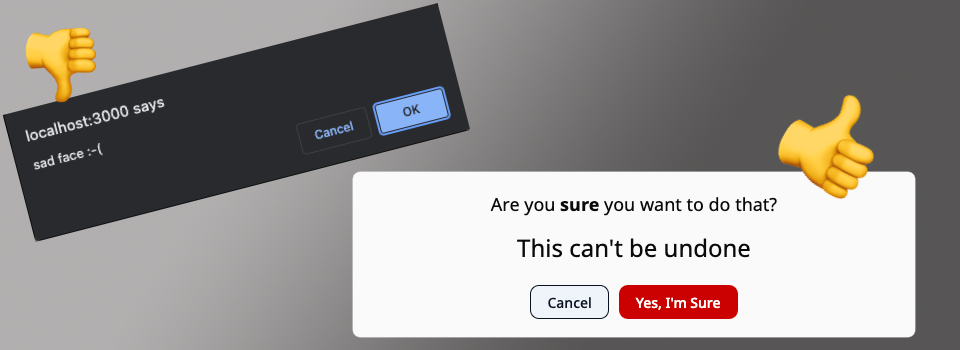

# RoleModel Confirm

A drop-in upgrade for Rails `data-turbo-confirm`.

[](https://github.com/RoleModel/turbo-confirm/actions/workflows/release-package.yml)




Leverage the convienience of _Turbo-Rails_, but ditch the native `confirm()` dialog.

### Installation

```Bash
npm install @rolemodel/turbo-confirm
```

or

```Bash
yarn add @rolemodel/turbo-confirm
```

### Usage

In your applications JavaScript entrypoint file. (_app/javascript/application.js_)

```JS
import {Turbo} from "@hotwired/turbo-rails"
import RoleModelConfirm from "@rolemodel/turbo-confirm"

Turbo.setConfirmMethod(RoleModelConfirm.confirm)

RoleModelConfirm.init()
```

And then exercise it via `button_to` (example shown in [slim](https://github.com/slim-template/slim) templating syntax)

```RUBY
  = button_to 'Delete ToDo', todo_path(todo),
    class: 'btn btn--danger',
    method: :delete,
    data: { \
      turbo_confirm: 'Are you sure?',
      confirm_details: tag.h2('This action cannot be undone'),
    }
```

or `link_to`

```RUBY
  = link_to 'Delete ToDo', todo_path(todo),
    class: 'btn btn--danger',
    data: { \
      turbo_method: :delete,
      turbo_confirm: 'Are you sure?',
      confirm_details: tag.h2('This action cannot be undone'),
    }
```

**Note:** `@rolemodel/turbo-confirm` supports additional custom content via specially named data attributes on the confirmation trigger.

We refer to these additional customization points as 'contentSlots' and the default configuration defines 3 (title, body, acceptText).

ContentSlots are completely optional.  Just supply your dialog HTML with default content for any contentSlots that you don't plan to define on every confirmation trigger.

### Configuration

`@rolemodel/turbo-confirm` is entirely configurable.  Override default configuration by passing an object into `init()`.

(_app/javascript/application.js_)

```JS

/* ... */

const contentSlots = {
  title: {
    contentAttribute: 'confirm-title',
    slotSelector: '.title'
  },
  subtitle: {
    contentAttribute: 'confirm-subtitle',
    slotSelector: '.subtitle'
  },
  note: {
    contentAttribute: 'confirm-note',
    slotSelector: '#confirm-body'
  }
}

RoleModelConfirm.init({contentSlots})
```

Based on that custom configuration, an example `button_to` trigger might look like this:

```RUBY
  = button_to 'Delete ToDo', todo_path(todo),
    class: 'btn btn--danger',
    method: :delete,
    data: { \
      turbo_confirm: true,
      confirm_title: tag.h1("You're about to do something dangerous!"),
      confirm_subtitle: tag.small('somewhat dangerous, at least..'),
      confirm_note: simple_format(todo.body),
    }
```

Obviously, the `slotSelector` of any contentSlots you configure will need to reference actual DOM elements that exist in your confirmation dialog template.

### Default Config

```JS
{
    dialogSelector: '#confirm',
    activeClass: 'modal--active',
    acceptSelector: '#confirm-accept',
    denySelector: '.confirm-cancel',
    animationDuration: 300,
    showConfirmCallback: null,
    contentSlots: {
      title: {
        contentAttribute: 'turbo-confirm',
        slotSelector: '#confirm-title'
      },
      body: {
        contentAttribute: 'confirm-details',
        slotSelector: '#confirm-body'
      },
      acceptText: {
        contentAttribute: 'confirm-button',
        slotSelector: '#confirm-accept'
      }
    }
  }
```

### Example Template

Based on default configuration, the following template is suitable.

```HTML
  <!-- Here is our dialog (not visible without a 'modal--active' class) -->
  <div id="confirm" class="modal">
    <div class="modal__backdrop confirm-cancel"></div>
    <div class="modal__content">
      <h3 id="confirm-title">Replaced by `data-turbo-confirm` attribute</h3>
      <div id="confirm-body">
        <p>Default confirm message.</p>
        <p>Optionally replaced by `data-confirm-details` attribute</p>
      </div>
      <div class="modal-actions">
        <button class="confirm-cancel">Cancel</button>
        <button id="confirm-accept">Yes, I'm Sure</button>
      </div>
    </div>
  </div>
```
