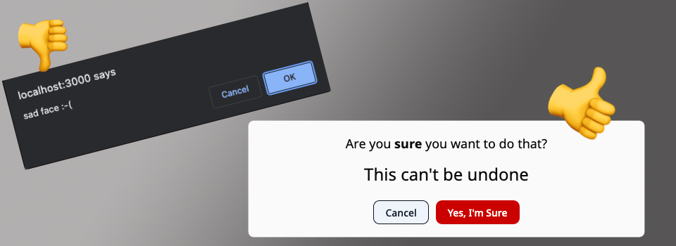

# RoleModel Confirm

A drop-in upgrade for Rails `data-turbo-confirm`.

[](https://github.com/RoleModel/turbo-confirm/actions/workflows/release-package.yml)




Leverage the convenience of _Turbo-Rails_, but ditch the native `confirm()` dialog.

### Installation

```Bash
npm install @rolemodel/turbo-confirm
```

or

```Bash
yarn add @rolemodel/turbo-confirm
```

### Usage

In your application's JavaScript entry point file. (_app/javascript/application.js_)

```JS
import { Turbo } from "@hotwired/turbo-rails"
import RM from "@rolemodel/turbo-confirm"

Turbo.setConfirmMethod(RM.confirm)

RM.init()
```

And then exercise it via `button_to` (example shown in [slim](https://github.com/slim-template/slim) templating syntax)

```RUBY
  = button_to 'Delete ToDo', todo_path(todo),
    class: 'btn btn--danger',
    method: :delete,
    data: { \
      turbo_confirm: 'Are you sure?',
      confirm_details: tag.h2('This action cannot be undone'),
    }
```

or `link_to`

```RUBY
  = link_to 'Delete ToDo', todo_path(todo),
    class: 'btn btn--danger',
    data: { \
      turbo_method: :delete,
      turbo_confirm: 'Are you sure?',
      confirm_details: tag.h2('This action cannot be undone'),
    }
```

**Note:** `@rolemodel/turbo-confirm` supports additional custom content via specially named data attributes on the confirmation trigger.

We refer to these additional customization points as 'contentSlots', and the default configuration defines three: `title`, `body`, and `acceptText`.

`contentSlots` is completely optional.  Just supply your dialog HTML with default content for any `contentSlots` you don't plan to define on every confirmation trigger.

### Configuration

`@rolemodel/turbo-confirm` is entirely configurable.  Override default configuration by passing an object into `init()`.

(_app/javascript/application.js_)

```JS

/* ... */

const contentSlots = {
  title: {
    contentAttribute: 'confirm-title',
    slotSelector: '.title'
  },
  subtitle: {
    contentAttribute: 'confirm-subtitle',
    slotSelector: '.subtitle'
  },
  note: {
    contentAttribute: 'confirm-note',
    slotSelector: '#confirm-body'
  }
}

RM.init({ contentSlots })
```

Obviously, the `slotSelector` of any contentSlots you configure will need to reference actual DOM elements in your confirmation dialog template.

### Default Config

```JS
{
    dialogSelector: '#confirm',
    activeClass: 'modal--active',
    acceptSelector: '#confirm-accept',
    denySelector: '.confirm-cancel',
    animationDuration: 300,
    showConfirmCallback: null,
    messageSlotSelector: '#confirm-title',
    contentSlots: {
      body: {
        contentAttribute: 'confirm-details',
        slotSelector: '#confirm-body'
      },
      acceptText: {
        contentAttribute: 'confirm-button',
        slotSelector: '#confirm-accept'
      }
    }
  }
```

### Example Template

Based on the default configuration, the following template is suitable.

```HTML
  <!-- Here is our dialog (not visible without a 'modal--active' class) -->
  <div id="confirm" class="modal">
    <div class="modal__backdrop confirm-cancel"></div>
    <div class="modal__content">
      <h3 id="confirm-title">Replaced by `data-turbo-confirm` attribute</h3>
      <div id="confirm-body">
        <p>Default confirm message.</p>
        <p>Optionally replaced by `data-confirm-details` attribute</p>
      </div>
      <div class="modal-actions">
        <button class="confirm-cancel">Cancel</button>
        <button id="confirm-accept">Yes, I'm Sure</button>
      </div>
    </div>
  </div>
```

### Manual Usage

Though `@rolemodel/turbo-confirm` was primarily designed to work as Turbo/Rails' confirmation interface, it may also be invoked directly by application code. Almost the same way you use native `window.confirm`.  While native confirm pauses execution until the user accepts or declines, TurboConfirm returns a promise.

e.g.

```JS
import { TurboConfirm } from "@rolemodel/turbo-confirm"

const turboConfirm = new TurboConfirm()
turboConfirm.confirm('Are you sure?').then(response => { response ? /* accepted */ : /* not accepted*/ })
```

TurboConfirm has an additional public method, `confirmWithContent` that expects a *contentMap* object where the keys are content slot selectors and the values are the content you want displayed in each selected element.

e.g.

```JS
import { TurboConfirm } from "@rolemodel/turbo-confirm"

const turboConfirm = new TurboConfirm()
turboConfirm.confirmWithContent({
  '#confirm-title': 'Are you sure?',
  '#confirm-accept': 'Do it!'
}).then(response => { response ? /* accepted */ : /* not accepted*/ })
```

### Stimulus Example

While Turbo will invoke `@rolemodel/turbo-confirm` for you in the case of a form submission (like `button_to`) or non-get link (like `link_to` w/ a `data-turbo-method`),  it doesn't in the case of a regular link or a button that does not submit a form.

In those cases, a simple Stimulus controller can be used.

e.g.

```JS

import { Controller } from "@hotwired/stimulus"
import { TurboConfirm } from "@rolemodel/turbo-confirm"

export default class extends Controller {
  #hasAccepted = false

  connect() {
    this.turboConfirm = new TurboConfirm({ /* Any Custom Configuration */ })
  }

  async perform(event) {
    if (this.#hasAccepted) {
      this.#hasAccepted = false
      return
    }

    event.preventDefault()
    event.stopImmediatePropagation()

    if (await this.turboConfirm.confirm(event.params.message)) {
      this.#hasAccepted = true
      event.target.click()
    }
  }
}

```

```HTML

<a href="https://rolemodelsoftware.com" data-controller="confirm" data-confirm-message-param="Do you need custom software?" data-action="confirm#perform">Click me</a>

```

### Configuration Documentation

TODO: markdown table explaining each config option w/ default values
